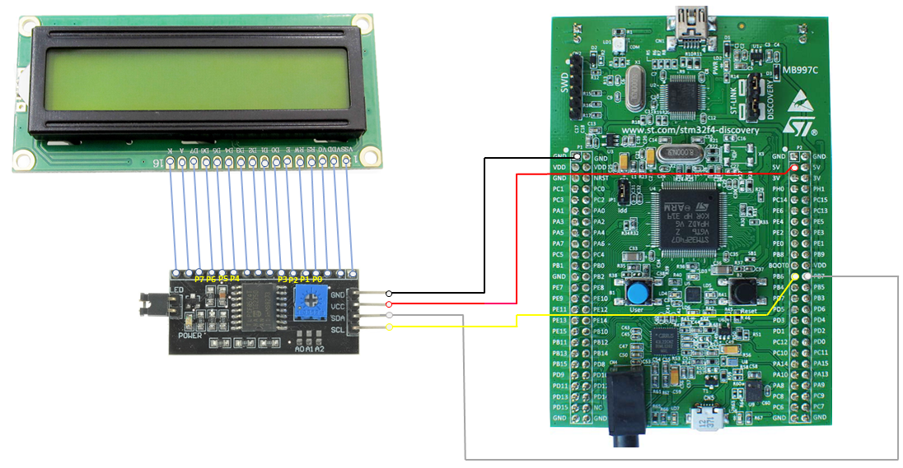

# Interfacing 16x02 LCD on STM32F407 Discovery using I2C module
This repository tells you how to interface a **16x02 LCD** on **STM32F4xx** MCU (I am using **[STM32F407 Discovery Kit](https://github.com/SharathN25/STM32F407-Discovery)**) using an **I2C Serial Interface** Module. Here I am using **4-bit mode** operation as the I2C(**[PCF8574T](https://www.nxp.com/part/PCF8574T)**) Serial Interface Module has 8-bit I/O expander(i.e, pin **P0** to **P7**). So basically what this means is we can control i.e, read/write data on 8 pins of I2C module. Hence 4 pins(P4 to P7) are used for **D4** to **D7** pins of LCD and other 4 pins (P0 to P3) are used for controlling **RS**, **R/W**, **E** and **K(LED -)** pins of LCD.

## Features of LCD16x02 I2C Driver 
Library code is simple and easy to understand. This library provides basically 3 functionality, they are:

1. Send Command to LCD
2. Send Data to LCD
3. Initialize LCD
4. Send String to LCD

Code is written without using **STM32CubeMX** tool, however you can also use CubeMX to generat I2C and MCU basic initialization code.

## Pin Connection Details

## Quick References
* **[Setting up I2C on STM32F407](https://www.youtube.com/watch?v=1COFk1M2tak)**
* **[Dot Matrix LCD Driver HD44780U](https://www.sparkfun.com/datasheets/LCD/HD44780.pdf)**

 
